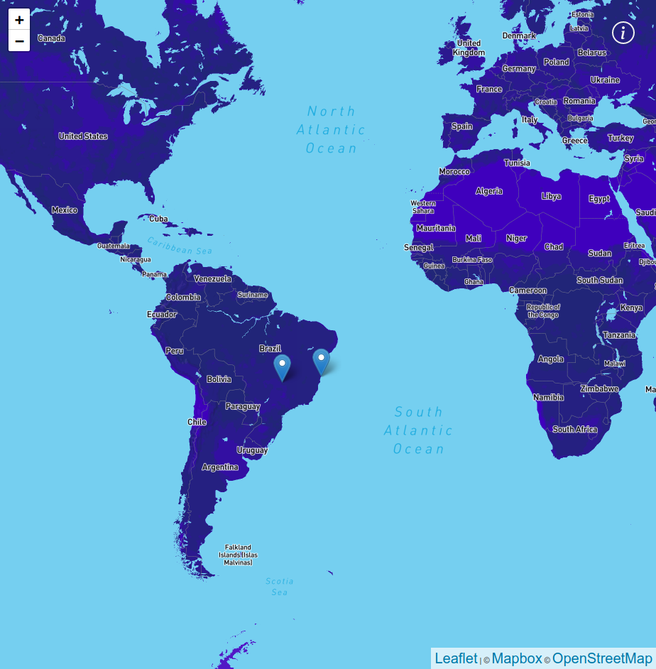

 

  <a href="https://www.linkedin.com/in/clayton-almeida-campos-198732176/">
    
  </a>
<h1 align="center">
Minhas viagens</h1>

> Web App para gerenciar suas viagens, mostrar os lugares fixados no mapa onde você já visitou ou deseja ir.

Mapa totalmente interativo utilizando a fantástica biblioteca do <b>Leaflet.</b>

Cada ponto no mapa é gerenciado através de um CMS na cloud chamado <b>GraphCMS </b> utilizando o NextJS para criar a melhor experiência para o usuário.


#### Libs utilizadas:
 * TypeScript
 * React
 * NextJS
 * GraphQL
 * Testing Library
 * Styled-components
 * Nextjs-progressbar


### Começando

##### GraphCMS

Este projeto usa [GraphCMS](https://graphcms.com/), então você precisa criar uma conta lá primeiro.

Depois de criar o Schema, basta seguir as etapas:
- Schema > Add New Model with `Place` name
- And add the following fields:
  - `Single Line Text` as `name`
  - `Slug` as `slug`
  - `Map` as `location`
  - `Rich Text` as `description`
  - `Asset Picker` as `gallery`

- Schema > Add New Model with `Page` name
- And add the following fields:
  - `Single Line Text` as `heading`
  - `Slug` as `slug`
  - `Rich Text` as `body`

Depois disso, preencha alguns valores e não se esqueça de `publicar`!

#### Autenticação

Para criar um acesso de token, vá para `Configurações> Acesso API`, dentro desta página, encontre` Tokens de autenticação permanente`,
crie um nome de token e marque todas as consultas possíveis. Salve e obtenha o token.

#### variaveis de ambiente
Crie seu arquivo `.env.local` com suas chaves.

GRAPHQL_HOST
GRAPHQL_TOKEN
NEXT_PUBLIC_MAPBOX_API_KEY
NEXT_PUBLIC_MAPBOX_USERID
NEXT_PUBLIC_MAPBOX_STYLEID

### NextJS

Depois de criar sua conta no [GraphCMS](https://graphcms.com/) e seguir as etapas acima, você só precisa renomear
o `.env.example` para` .env.local` (se você planeja executar localmente) e edite as chaves lá.

Com tudo pronto, você pode iniciar o aplicativo com:

```bash
npm run dev
# ou
yarn dev
```

Abra [http://localhost:3000](http://localhost:3000) com seu navegador para ver o resultado.

Você pode começar a editar a página modificando `pages / index.js`. A página é atualizada automaticamente conforme você edita o arquivo.

## Comandos

- `dev`: executa seu aplicativo em` localhost: 3000`
- `build`: cria a versão de construção de produção
- `start`: inicia um servidor simples com o código de produção de construção
- `lint`: executa o linter em todos os componentes e páginas
- `test`: executa jest para testar todos os componentes e páginas
- `test: watch`: executa jest no modo watch


## Preview



[Veja rodando](https://minhas-viagens-claytoncampos.vercel.app/)

## Saber mais

Para saber mais sobre Next.js, dê uma olhada nos seguintes recursos:

- [Documentação Next.js](https://nextjs.org/docs) - aprenda sobre os recursos e API do Next.js.
- [Aprenda Next.js](https://nextjs.org/learn) - um tutorial interativo Next.js.

Você pode verificar [o repositório Next.js GitHub](https://github.com/vercel/next.js/) - seus comentários e contribuições são bem-vindos!


Feito com ♥ por Clayton Campos
:wave: [Get in touch!](https://www.linkedin.com/in/clayton-almeida-campos-198732176/)
